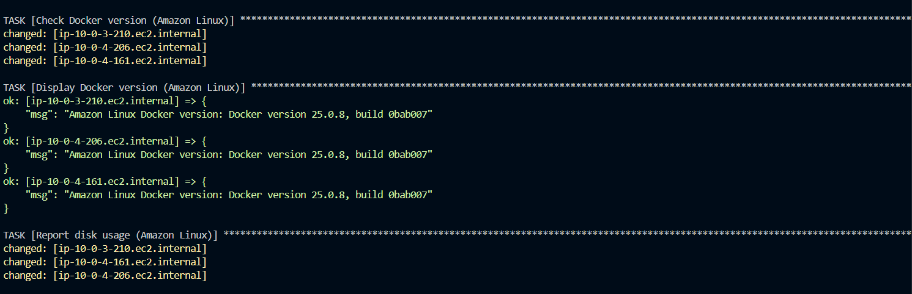
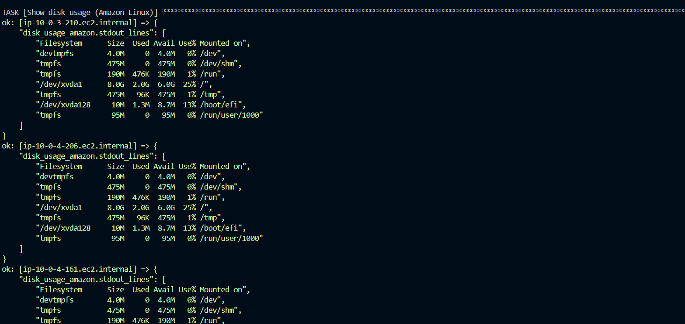
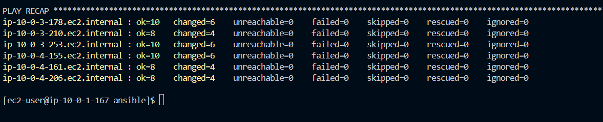

# AWS Infrastructure with Ansible and Terraform

## Overview

This project demonstrates how to provision AWS resources using [Terraform](https://developer.hashicorp.com/terraform/install?product_intent=terraform) and Configure & manage 6 target EC2 instances (Ubuntu & Amazon Linux) using [Ansible](https://www.redhat.com/en/ansible-collaborative)


After deployment, you will be able to:
SSH into the Ansible Controller EC2 instance.
From that controller, run the Ansible playbook to manage the other 6 EC2 instances.


## Prerequisites

 **Terraform**  
   Install [Terraform](https://developer.hashicorp.com/terraform/install?product_intent=terraform).  
   - **Windows**: `choco install terraform`
   - **Mac**: Use Homebrew:  
     ```bash
     brew tap hashicorp/tap
     brew install hashicorp/tap/terraform
     ```

Verify the Installation

Run terraform in your terminal. You should see a help message or usage instructions.


2. **AWS Credentials**  
   You will need the following from your AWS account (often provided when you create or refresh AWS CLI credentials):
   - `AWS_ACCESS_KEY_ID`
   - `AWS_SECRET_ACCESS_KEY`
   - `AWS_REGION="us-east-1"`
   - `AWS_SESSION_TOKEN` (if using temporary session credentials)
   if you are on aws acedemy click on show to get them
   

3. **lab key**

   download your pem file from here by clicking on download PEM

   


---

## Installation & Setup

1. **Clone the Repository and switch branch**  
   ```bash
   git clone https://github.com/Devenvaruv/Packer-Terraform-guide.git

   git switch assignment10

Set Environment Variables
Depending on your OS:

Windows (PowerShell)

    $env:AWS_ACCESS_KEY_ID="YOUR_ACCESS_KEY"
    $env:AWS_SECRET_ACCESS_KEY="YOUR_SECRET_KEY"
    $env:AWS_SESSION_TOKEN="YOUR_SESSION_TOKEN"

Mac / Linux (Bash)

    export AWS_ACCESS_KEY_ID="YOUR_ACCESS_KEY"
    export AWS_SECRET_ACCESS_KEY="YOUR_SECRET_KEY"
    export AWS_SESSION_TOKEN="YOUR_SESSION_TOKEN"


### Provisioning Infrastructure (Terraform)
Navigate back to the main folder, then into the Terraform directory:

    cd ..
    cd terraform

### Initialize, Plan, and Apply with Terraform:

    terraform init
    terraform plan
    terraform apply

When prompted, type yes to confirm.

Upon successful completion, Terraform will output:

The Public IP address of the controller host.

The Private IP addresses of the six EC2 instances.

### Connecting to Your Instances

Move your labsuser.pem key to the project home directory

Check if your key already exist:

    ssh-add -l

If key is not listed, add it:

    ssh-add labsuser.pem

go back to the project root directory.

    cd ..

then we need to copy the whole ansible folder to the controller instance; run this command

    scp -i labsuser.pem -r .\ansible\ ec2-user@3.82.65.99:/home/ec2-user/


all of those files inside /ansible should be copied into the ec2.

SSH into the Controller Host:

    ssh -A -i labsuser.pem ec2-user@YOUR_BASTION_PUBLIC_IP


run

    ls

there should be an ansible folder

cd into it


make the install_ansible.sh executable and run it

    chmod +x install_ansible.sh

if you get this error due to the file being created on a windows device


install dos2unix library and run it

    sudo yum install dos2unix -y
    dos2unix install_ansible.sh

then run 

    bash install_ansible.sh


now copy and paste these variable to the terminal

    export AWS_ACCESS_KEY_ID="YOUR_ACCESS_KEY"
    export AWS_SECRET_ACCESS_KEY="YOUR_SECRET_KEY"
    export AWS_SESSION_TOKEN="YOUR_SESSION_TOKEN"
    export AWS_REGION="us-east-1"

and then run this command to run the playbook

    ansible-playbook -i aws_ec2.yml ansible_playbook.yml -e 'ansible_ssh_common_args="-o StrictHostKeyChecking=no -o UserKnownHostsFile=/dev/null"'








after running it successfully you should be able to see the play steps, docker version, any updates and upgrades and disk usage for each instance.


