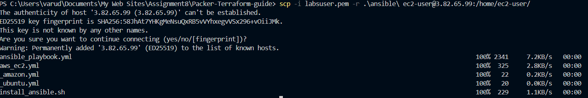
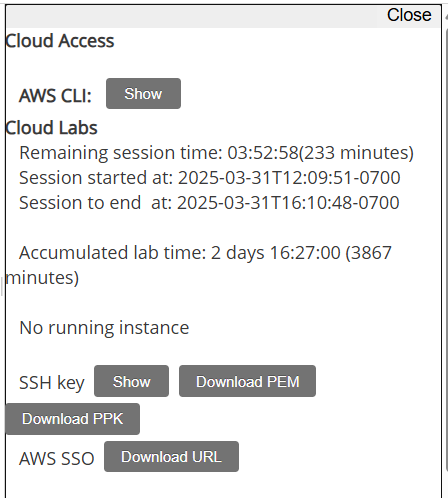
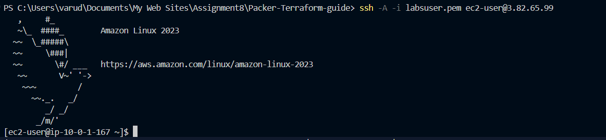
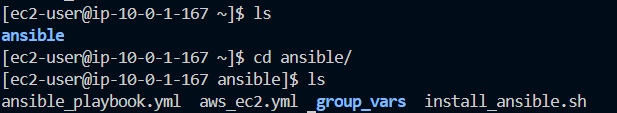
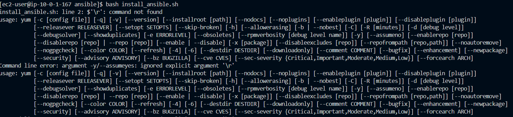

# AWS Infrastructure with Packer and Terraform

## Overview

This project demonstrates how to build a custom Amazon Machine Image (AMI) using [Packer](https://developer.hashicorp.com/packer/install) and then provision AWS resources using [Terraform](https://developer.hashicorp.com/terraform/install?product_intent=terraform).

### What the project does

1. **Custom AWS AMI (Packer)**
   - Starts with **Amazon Linux**.
   - Installs **Docker**.
   - Injects your **SSH public key** so you can log in using the corresponding private key.

2. **Provision AWS resources (Terraform)**
   - Creates a **VPC** with private and public subnets, plus the necessary routes (using Terraform modules).
   - Sets up **1 Bastion Host** in the public subnet (restricted access on port 22 to your IP address).
   - Launches **6 EC2 instances** in the private subnet based on the custom AMI you created via Packer.

After successful deployment, you will be able to:
- SSH into the bastion host using your private key.
- From the bastion host, SSH into any of the 6 private EC2 instances.

---

## Prerequisites

1. **Packer**  
   Install [Packer](https://developer.hashicorp.com/packer/install).  
   - **Windows**: `choco install packer`
   - **Mac**: Use [Homebrew](https://brew.sh):  
     ```bash
     brew tap hashicorp/tap
     brew install hashicorp/tap/packer
     ```

2. **Terraform**  
   Install [Terraform](https://developer.hashicorp.com/terraform/install?product_intent=terraform).  
   - **Windows**: `choco install terraform`
   - **Mac**: Use Homebrew:  
     ```bash
     brew tap hashicorp/tap
     brew install hashicorp/tap/terraform
     ```

Verify the Installation

Run packer in your terminal. You should see a help message or usage instructions.


Run terraform in your terminal. You should see a help message or usage instructions.


3. **AWS Credentials**  
   You will need the following from your AWS account:
   - `AWS_ACCESS_KEY_ID`
   - `AWS_SECRET_ACCESS_KEY`
   - `AWS_SESSION_TOKEN`
    
   if you are on AWS Academy click on Show to get them
   
   

5. **SSH Keys**
   - **Public key**: Will be baked into the AMI so you can SSH in.
   - **Private key**: Used to SSH into instances (keep this secure).
   if you do not want to use the old key you can generate a new key by running this command
    ```
    ssh-keygen -t rsa -b 4096 -C "your_email@example.com"

6. **Git**
   - Install Git to clone the repository.

---

## Installation & Setup

1. **Clone the Repository**  
   ```bash
   git clone https://github.com/Devenvaruv/Packer-Terraform-guide.git
   cd Packer-Terraform-guide
Set Environment Variables
Depending on your OS:

Windows (PowerShell)

    $env:AWS_ACCESS_KEY_ID="YOUR_ACCESS_KEY"
    $env:AWS_SECRET_ACCESS_KEY="YOUR_SECRET_KEY"
    $env:AWS_SESSION_TOKEN="YOUR_SESSION_TOKEN"

Mac / Linux (Bash)

    export AWS_ACCESS_KEY_ID="YOUR_ACCESS_KEY"
    export AWS_SECRET_ACCESS_KEY="YOUR_SECRET_KEY"
    export AWS_SESSION_TOKEN="YOUR_SESSION_TOKEN"


### Building the Custom AMI (Packer)
Navigate to the Packer directory:

    cd packer
Build the AMI with your public key:

copy your public key value and paste it below


Windows (PowerShell) example:

    packer build -var "public_key=ssh-rsa AAAAB..... @youruser" custom-ami.json

Mac / Linux example:

    packer build -var "public_key=ssh-rsa AAAAB..... @youruser" custom-ami.json

Note: -var flag expected the actual value of the key not the path of the key.

if you get any error related to amazon-ebs run this command and then run the original again

    packer plugins install github.com/hashicorp/amazon

Wait for the build to complete (approximately 3–4 minutes).

Start of build


Upon success, Packer will output the AMI ID.



The same AMI ID will also appear in manifest.json.


Copy the newly created AMI ID.

### Provisioning Infrastructure (Terraform)
Navigate back to the main folder, then into the Terraform directory:

    cd ..
    cd terraform

Update terraform.tfvars with your newly created AMI ID:

    custom_ami_id = "ami-XXXXXXXXXXXXX"
Replace "ami-XXXXXXXXXXXXX" with the actual AMI ID from your Packer build.


### Initialize, Plan, and Apply with Terraform:

    terraform init
    terraform plan
    terraform apply


When prompted, type yes to confirm.


Upon successful completion, Terraform will output:

The Public IP address of the bastion host.

The Private IP addresses (or private DNS) of the six EC2 instances.


### Connecting to Your Instances

Add Your Private Key to SSH Agent (if needed):

    ssh-add -l

If no key is listed, add it:

    ssh-add /path/to/your_private_key
SSH into the Bastion Host:

    ssh -A -i "/path/to/your_private_key" ec2-user@YOUR_BASTION_PUBLIC_IP


-A forwards your SSH agent, allowing you to SSH into the private instances without copying the private key onto the bastion.

From the Bastion Host, SSH into a Private EC2 Instance:

    ssh ec2-user@PRIVATE_EC2_IP


You are now inside one of your private EC2 instances.

Docker TEST:


additional info you will see on AWS


Bastion host only have public ip rest of them having private ip.

Bastion ec2 details


only allowing on port 22 from host.


private ec2


only allow inbound from the bastion


Elastic ip


VPC


